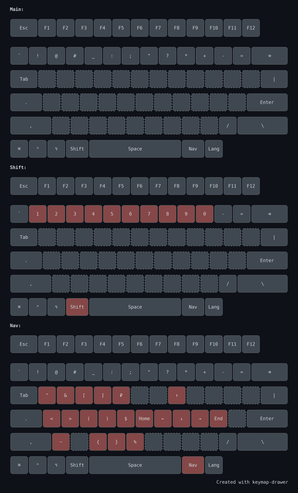

# Мои раскладки для Moonlander и стандартной клавиатуры Mac

СТАТЬЯ В РАЗРАБОТКЕ - РАСКЛАДКИ ЕЩЕ НЕ ЗАКОНЧЕНЫ!!!

Вдохновение:
- [статья от @optozorax](https://optozorax.github.io/p/my-keyboard-layout)
- [Ergo Mods](https://dreymar.colemak.org/ergo-mods.html)
- [Hands-Down](https://sites.google.com/alanreiser.com/handsdown/home/hands-down-neu)

Имеем такие вводные
- Английская раскладка: QWERTY (26 букв)
- Русская раскладка: ЙЦУКЕН без Ё (32 буквы)
- Слепая печать, пустые кейкапы без гравировки
- Знаки препинания должны быть в одних и тех же местах независимо от раскладки
- Цифры вынесены в отдельный цифровой слой
- Стрелки и Home/End вынесены в отдельный навигационный слой
- CapsLock не нужен, а Shift под левым большим пальцем
- Right Shift, Right Ctrl, Right Alt не нужны
- Ctrl и Shift должны находиться впритык друг к другу и нажиматься одним большим пальцем, чтобы можно было без проблем прожимать сочетания клавиш
- Esc, Tab, Space должны находится на своих местах
- Отдельный игровой слой со стандартной раскладкой


## Кнопки (левая половина клавиатуры)

Подразумевается что кнопки из этой таблицы часто или редко используются вместе с мышью или исторически их расположение удобно на левой половине клавиатуры.

| Клавиша  | Использование                                                                | Тамб                | Слой                                     |
| -------- | ---------------------------------------------------------------------------- | ------------------- | ---------------------------------------- |
| Esc      | Редко для выхода из меню                                                     |                     | Основной слой, исторически               |
| Tab      | Табуляции кода, переключение между вкладками или элементами                  |                     | Основной слой, исторически               |
| Shift    | Выделения диапазона или нескольких объектов                                  | Строго              | Основной слой                            |
| Ctrl     | для multi-select / спец-действий                                             | Строго              | Основной слой                            |
| Alt      | некоторые спец-действия в программах                                         | Желательно          | Основной слой                            |
| Win      | для запуска программ, управления окнами, скриншотов, буфера обмена           | Желательно          | Основной слой                            |
| Space    | вставить пропущенный пробел                                                  | Строго, исторически | Основной слой                            |
| Delete   | Удаление текста, файлов, элементов                                           | Желательно          | Основной слой                            |
| .,       | Часто текст и числа                                                          |                     | основной слой                            |
| +-=      | да?                                                                          |                     | Основной слой                            |
| _        | Часто программирование и редко текст                                         |                     | Основной слой                            |
| !@#      | нет                                                                          |                     | Основной слой, исторически удобно на 123 |
| "        | Часто программирование и текст                                               |                     | Основной слой                            |
| '        | Редко программирование и английский текст                                    |                     | Основной слой                            |
| `        | Часто программирование и текст                                               |                     | Основной                                 |
| Nums     | Кастомный слоефикатор для цифрового слоя                                     | Строго              | Основной слой                            |
| 0-9      |                                                                              |                     | Цифровой слой                            |
| ₽$%      | Редко числа                                                                  |                     | Цифровой слой                            |
| ~        | Редко числа                                                                  |                     | Цифровой слой                            |
| ^        | Редко числа                                                                  |                     | Цифровой слой                            |
| ()[]{}<> | Оборочивают выделенный мышкой текст в скобки. Часто текст и программирование |                     | Символьный                               |


## Кнопки (правая половина клавиатуры)

| Клавиша    | Использование                                 | Тамб       | Слой                  |
| ---------- | --------------------------------------------- | ---------- | --------------------- |
| Backspace  | Удалить символ, слово, строку                 | Желательно | Основной              |
| Enter      | Перенос текста, подтверждение                 | Желательно | Основной              |
| Lang       | Смена языка                                   | Желательно | Основной              |
| Nav        | Кастомный слоефикатор для навигационного слоя | Желательно | Основной              |
| Arrows     | Перемещение по тексту без мыши                |            | Навигационный         |
| Home/End   | Перемещение по тексту без мыши                |            | Навигационный         |
| ?          | Текст                                         |            | Основной              |
| \|         | Часто программирование и редко текст          |            | Основной              |
| *          | Редко программирование                        |            | Основной, исторически |
| :          | Часто программирование и текст                |            | Основной              |
| /          | Часто программирование и редко текст          |            | Основной              |
| \          | Редко программирование                        |            | Основной              |
| ;          | Часто программирование и редко текст          |            | Основной              |
| &          | Редко текст                                   |            | Символьный            |
| Volume     | Изменение громкости                           |            |                       |
| Brightness | Изменение яркости                             |            |                       |


## Сочетания клавиш

| Action                                   | System | Windows/Mac modifiers  | Key         |
| ---------------------------------------- | ------ | ---------------------- | ----------- |
| провалиться; открыть в новой вкладке     | WM     | Ctrl/Command           | L. Click    |
| открыть в новом окне                     | WM     | Shift                  | L. Click    |
| следующая вкладка / следующий элемент    | WM     | Control / Ctrl         | Tab         |
| предыдущая вкладка / предыдущий элемент  | WM     | Control / Ctrl + Shift | Tab         |
| копировать                               | WM     | Ctrl/Command           | C           |
| вырезать                                 | WM     | Ctrl/Command           | X           |
| вставить                                 | WM     | Ctrl/Command           | V           |
| отмена                                   | WM     | Ctrl/Command           | Z           |
| отмена отмены                            | WM     | Ctrl/Command + Shift   | Z           |
| выделить всё                             | WM     | Ctrl/Command           | A           |
| удалить слово                            | WM     | Ctrl/Option            | Backspace   |
| перейти на слово влево/вправо            | WM     | Ctrl/Option            | L./R. Arrow |
| выделение по словам / блоками            | WM     | Ctrl/Option + Shift    | Arrow       |
| выделение текста / объектов              | WM     | Shift                  | Arrow       |
| отмена табуляции                         | WM     | Shift                  | Tab         |
| новая строка без отправки                | WM     | Shift                  | Enter       |
| скриншот области                         | WM     | Win/Command + Shift    | S           |
| Force Quit                               | M      | Option + Command       | Esc         |
| Spotlight                                | M      | Command                | Space       |
| переключение окон                        | W      | Alt                    | Tab         |
| удалить без корзины                      | W      | Shift                  | Delete      |
| экран безопасности Windows               | W      | Ctrl + Alt             | Delete      |
| меню Пуск / системный поиск              | W      | Win                    | —           |
| открыть поиск                            | W      | Win                    | S           |
| открыть проводник                        | W      | Win                    | E           |
| показать рабочий стол                    | W      | Win                    | D           |
| заблокировать компьютер                  | W      | Win                    | L           |
| открыть окно "Выполнить"                 | W      | Win                    | R           |
| открыть настройки                        | W      | Win                    | I           |
| открыть историю буфера обмена            | W      | Win                    | V           |
| показать все окна и рабочие столы        | W      | Win                    | Tab         |
| создать новый виртуальный рабочий стол   | W      | Win + Ctrl             | D           |
| закрыть текущий виртуальный рабочий стол | W      | Win + Ctrl             | F4          |
| следующий виртуальный рабочий стол       | W      | Win + Ctrl             | Right Arrow |
| предыдущий виртуальный рабочий стол      | W      | Win + Ctrl             | Left Arrow  |
| прикрепить окно влево                    | W      | Win                    | Left Arrow  |
| прикрепить окно вправо                   | W      | Win                    | Right Arrow |
| развернуть окно                          | W      | Win                    | Up Arrow    |
| свернуть / восстановить окно             | W      | Win                    | Down Arrow  |

## Цифровой слой

- Q - ^
- Z - ~
- AXCVSDFWER - 0-9
- TGB - ₽$%

1. Требуется при работе с мышью, а значит должен быть расположен слева. К тому же для цифрового блока не требуются модификаторы.
2. Для работы с цифровым блоком нужен мизинец, а значит слоефикатор может быть только на большом пальце.
3. Рядом с цифровым блоком на основном слое должны располагаться точка и запятая, так как они используются для написания дробных чисел

## Символьный слой
...

## Навигационный слой
- IJKL - Arrows
- H; - home end

1. Так как для стрелок нужны модификаторы Shift для выделения текста и Ctrl для движения по словам, а модификаторы строго на левом большом пальце, то мы не можем разместить слоефикатор на этом пальце
2. Учитывая, что при работает стрелочками часто не требуется мышь, то и размешать их на левой половине клавиатуры нет смысла. К тому же вместо со стрелочками удобно использовать скобки и цифры, а они находятся на левой части клавиатуры


## Стандартная клавиатура Mac



Картинка сделана в https://keymap-drawer.streamlit.app

Для того чтобы подогнать клавиатуру под наши стандарты нужно, чтобы слева от пробела было 4 кнопки, иначе не поместиться Shift. На Mac как раз такая клавиатура

Даже имея 4 кнопки нам все равно не хватит места под отдельную кнопку для цифрового слоя и для кнопки Forward Delete, которая очень полезна при работе с мышью.

Справа, в свою очередь, не нашлось места для перестановки Backspace, так что его мы тоже оставляем на своем, хоть и привычном, но неудобном месте

Также мы не можем использовать Option как слоефикатор из за некоторых сочетаний клавиш, которые не дают печатать символы в некоторых программах.

### Алгоритм настройки

Я привык, что создание скриншотов на Windows делается командой Win+Shift+S
Чтобы сделать подобное поведение на маке делаем следующиую настройку:


Также нужно отключить изменение раскладки на горячие клавиши, чтобы случайно не менять раскладки:


Отключаем функции на F-клавишах, чтобы освободить клавишу Fn/Globe:


Отключить Quick Note на правый нижний угол в `System Settings → Desctope & Dock -> Hot corners...`

Включить разворот окна на весь экран по двойному нажатию в `System Settings → Desktop & Dock -> Window title bar double-click action`

1. Кладём `.bundle` в папку `~/Library/Keyboard Layouts`
2. Перезагружаем Mac
3. Открываем `System Settings → Keyboard → Input Sources`
4. Добавляем раскладки:
   - `English (C)`
   - `Russian (C)`
5. Скачиваем и устанавливаем [Karabiner-Elements](https://karabiner-elements.pqrs.org)
6. В `Karabiner-Elements → Complex Modifications` нажимаем `Add your own rule`
7. Вставляем туда содержимое файлов `karabiner-arrows.json`,  и сохраняем
8. По желанию отключаем системный пузырёк-индикатор языка, чтобы он не отвлекал:

```sh
defaults write kCFPreferencesAnyApplication TSMLanguageIndicatorEnabled -bool false
```

Этот пузырёк часто показывает неверный язык, поэтому польза от него сомнительная.

### Почему отключены физические стрелки

Если оставить рабочими стрелки справа снизу, рука почти всегда будет тянуться именно к ним. Из-за этого слой стрелок под `Caps` осваивается медленнее или не осваивается вообще.

Поэтому скрипт отключает физические стрелки и оставляет рабочим только слой `Caps + W/A/S/D`. Это небольшое принуждение, которое заметно ускоряет переучивание.


## Windows: Moonlander

Поскольку я не умею писать на C, пришлось менять системные раскладки с помощью [MSKLC](https://www.microsoft.com/en-us/download/details.aspx?id=102134).

### Установка для Windows

Скачиваем [мою прошивку](https://configure.zsa.io/moonlander/layouts/WazEM/latest/0) и [программу для прошивки](https://www.zsa.io/flash), после чего прошиваем клавиатуру.

Скачиваем этот репозиторий и устанавливаем модифицированную русскую раскладку через `setup.exe`. Старую русскую раскладку можно удалить. После установки лучше перезагрузить систему.
