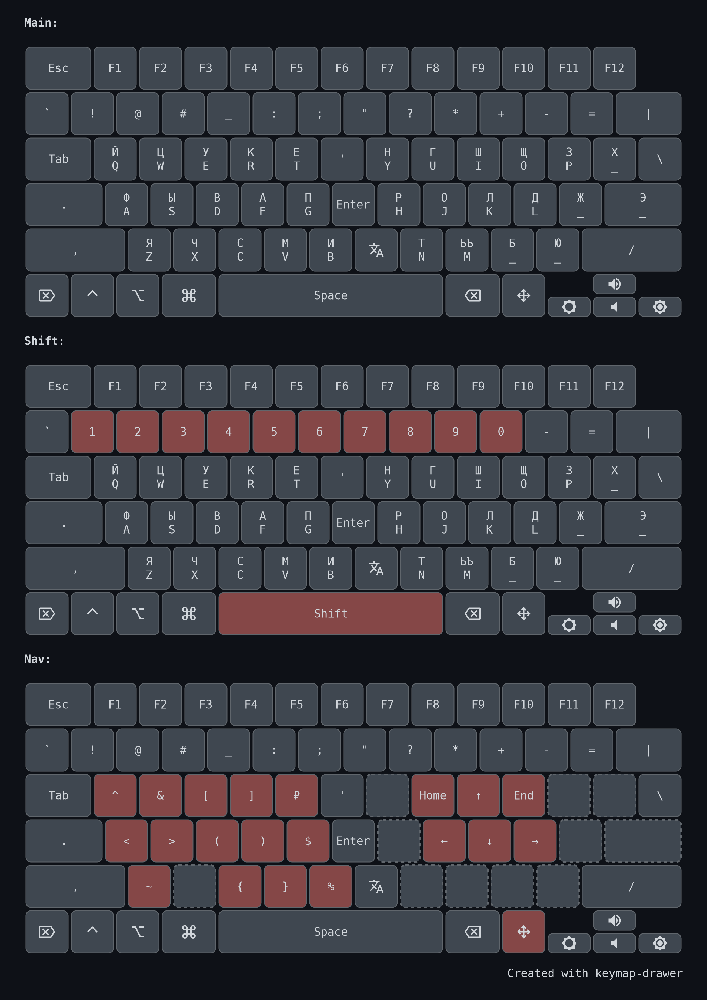
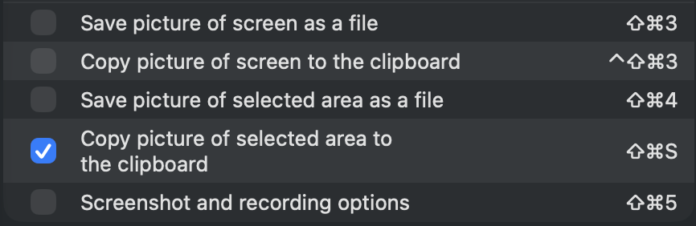
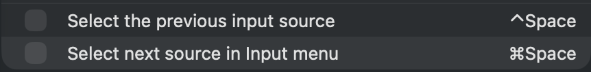
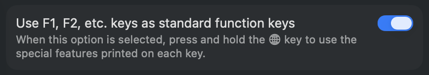
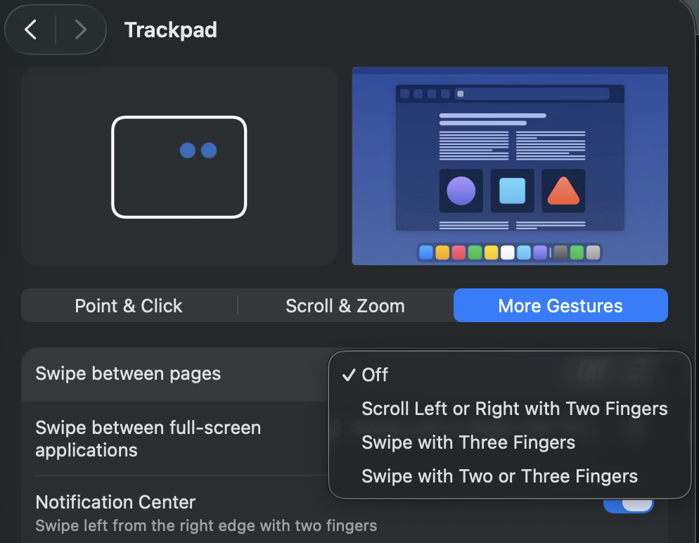

# Мои раскладки для Moonlander и стандартной клавиатуры Mac

Изменить свою раскладку меня побудили эти материалы:
- [Статья от @optozorax](https://optozorax.github.io/p/my-keyboard-layout)
- [Ergo Mods](https://dreymar.colemak.org/ergo-mods.html)
- [Hands-Down](https://sites.google.com/alanreiser.com/handsdown/home/hands-down-neu)

## Вводные данные
- Я НЕ пробовал Home Row Mode
- Я НЕ пробовал комбо, аккорды
- Я пользуюсь английской раскладкой QWERTY и русской раскладкой ЙЦУКЕН
- Я не использую букву Ё
- (tap-dance-eager) Один тап ь - ь, двойной тап - ъ
- (tap-dance-eager) Один там под дефису это дефис, а двойной тап это тире
- Слепая печать и пустые кейкапы без гравировки
- Знаки препинания должны быть в одних и тех же местах независимо от раскладки
- Цифры должны быть вынесены в отдельный цифровой слой в форме нампада на левой руке, чтобы можно было печатать цифры, работая с мышью
- Точка и запятая должны быть рядом с цифровым слоем на левой руке для печати дробных чисел
- Стрелки и Home/End вынесены в отдельный навигационный слой на правой руке
- CapsLock не нужен, а Shift под левым большим пальцем
- Правые модификаторы R. Shift, R. Ctrl, R. Alt я не использую
- Ctrl и Shift должны находиться впритык друг к другу и нажиматься одним большим пальцем, чтобы можно было без проблем прожимать сочетания клавиш (например Ctrl+Shift+S для скриншота)
- Esc, Tab, Space должны находится на стандартных местах
- Отдельный игровой слой со стандартной раскладкой
- Переключение по частоиспользуемые приложения сочетанием клавиш

### Кнопка для смены языка
Отдельная кнопка для смены языка, как для частого действия.
Смена языка используется только во время печати обеими руками, а значит кнопка может находится в правой части клавиатуры.
Предпочтительна под большим пальцем, но по факту может нажиматься любым другим удобным пальцем: указатальным или мизинцем

Смена языка должна быть абсолютной, а не относительной. Это позволяет клавиатуре знать текущий язык и менять поведение в зависимости от этого.
Можно сделать отдельную кнопку для каждого языка, но я предпочитаю tap-dance-eager: первое нажатие - Английский, второе - Русский. Причем нужно использовать именно "жадный" tap-dance, который сменяет языки моментально, а не ждет кулдаун.

### Кнопки (левая половина клавиатуры)

Подразумевается что кнопки из этой таблицы часто или редко используются вместе с мышью или исторически их расположение удобно на левой половине клавиатуры.

| Клавиша  | Использование                                                | Тамб       | Слой                                     |
| -------- | ------------------------------------------------------------ | ---------- | ---------------------------------------- |
| Esc      | Выход из меню                                                |            | Основной слой                            |
| Tab      | Табуляции кода, переключение между вкладками или элементами  |            | Основной слой                            |
| Shift    | Выделения диапазона или нескольких объектов, капс            | Строго     | Основной слой                            |
| Ctrl     | multi-select и сочетания клавиш                              | Строго     | Основной слой                            |
| Alt      | Сочетания клавиш                                             | Желательно | Основной слой                            |
| Win      | Пуск, управления окнами, скриншоты, буфера обмена            | Желательно | Основной слой                            |
| Space    |                                                              | Строго     | Основной слой                            |
| Delete   | Удаление текста, файлов, элементов                           |            | Основной слой                            |
| .,       | Часто программирование, текст и числа                        |            | Основной слой                            |
| +-=      | Часто программирование и текст                               |            | Основной слой                            |
| _        | Часто программирование и редко текст                         |            | Основной слой                            |
| !@#      | Часто программирование и текст                               |            | Основной слой, исторически удобно на 123 |
| "        | Часто программирование и текст                               |            | Основной слой                            |
| '        | Редко программирование и текст                               |            | Основной слой                            |
| `        | Часто программирование и текст                               |            | Основной                                 |
| Nums     | Кастомный слоефикатор для цифрового слоя                     | Строго     | Основной слой                            |
| 0-9      |                                                              |            | Цифровой слой                            |
| ₽$%      | Редко числа                                                  |            | Цифровой слой                            |
| ~        | Редко числа                                                  |            | Цифровой слой                            |
| ^        | Редко числа                                                  |            | Цифровой слой                            |
| ()[]{}<> | Часто программирование и текст                               |            | Символьный                               |


### Кнопки (правая половина клавиатуры)

| Клавиша    | Использование                                 | Тамб       | Слой                  |
| ---------- | --------------------------------------------- | ---------- | --------------------- |
| Backspace  | Удалить символ, слово, строку                 | Желательно | Основной              |
| Enter      | Перенос текста, подтверждение                 | Желательно | Основной              |
| Lang       | Смена языка                                   | Желательно | Основной              |
| Nav        | Кастомный слоефикатор для навигационного слоя | Желательно | Основной              |
| Arrows     | Перемещение по тексту без мыши                |            | Навигационный         |
| Home/End   | Перемещение по тексту без мыши                |            | Навигационный         |
| ?          | Текст                                         |            | Основной              |
| \|         | Часто программирование и редко текст          |            | Основной              |
| *          | Редко программирование                        |            | Основной, исторически |
| :          | Часто программирование и текст                |            | Основной              |
| /          | Часто программирование и редко текст          |            | Основной              |
| \          | Редко программирование                        |            | Основной              |
| ;          | Часто программирование и редко текст          |            | Основной              |
| &          | Редко текст                                   |            | Символьный            |
| Volume     | Изменение громкости                           |            |                       |
| Brightness | Изменение яркости                             |            |                       |


### Сочетания клавиш

| Action                                   | System | Windows/Mac modifiers  | Key         |
| ---------------------------------------- | ------ | ---------------------- | ----------- |
| провалиться; открыть в новой вкладке     | WM     | Ctrl/Command           | L. Click    |
| открыть в новом окне                     | WM     | Shift                  | L. Click    |
| следующая вкладка / следующий элемент    | WM     | Control / Ctrl         | Tab         |
| предыдущая вкладка / предыдущий элемент  | WM     | Control / Ctrl + Shift | Tab         |
| копировать                               | WM     | Ctrl/Command           | C           |
| вырезать                                 | WM     | Ctrl/Command           | X           |
| вставить                                 | WM     | Ctrl/Command           | V           |
| отмена                                   | WM     | Ctrl/Command           | Z           |
| отмена отмены                            | WM     | Ctrl/Command + Shift   | Z           |
| выделить всё                             | WM     | Ctrl/Command           | A           |
| удалить слово                            | WM     | Ctrl/Option            | Backspace   |
| перейти на слово влево/вправо            | WM     | Ctrl/Option            | L./R. Arrow |
| выделение по словам / блоками            | WM     | Ctrl/Option + Shift    | Arrow       |
| выделение текста / объектов              | WM     | Shift                  | Arrow       |
| отмена табуляции                         | WM     | Shift                  | Tab         |
| новая строка без отправки                | WM     | Shift                  | Enter       |
| скриншот области                         | WM     | Win/Command + Shift    | S           |
| Force Quit                               | M      | Option + Command       | Esc         |
| Spotlight                                | M      | Command                | Space       |
| переключение окон                        | W      | Alt                    | Tab         |
| удалить без корзины                      | W      | Shift                  | Delete      |
| экран безопасности Windows               | W      | Ctrl + Alt             | Delete      |
| меню Пуск / системный поиск              | W      | Win                    | —           |
| открыть поиск                            | W      | Win                    | S           |
| открыть проводник                        | W      | Win                    | E           |
| показать рабочий стол                    | W      | Win                    | D           |
| заблокировать компьютер                  | W      | Win                    | L           |
| открыть окно "Выполнить"                 | W      | Win                    | R           |
| открыть настройки                        | W      | Win                    | I           |
| открыть историю буфера обмена            | W      | Win                    | V           |
| показать все окна и рабочие столы        | W      | Win                    | Tab         |
| создать новый виртуальный рабочий стол   | W      | Win + Ctrl             | D           |
| закрыть текущий виртуальный рабочий стол | W      | Win + Ctrl             | F4          |
| следующий виртуальный рабочий стол       | W      | Win + Ctrl             | Right Arrow |
| предыдущий виртуальный рабочий стол      | W      | Win + Ctrl             | Left Arrow  |
| прикрепить окно влево                    | W      | Win                    | Left Arrow  |
| прикрепить окно вправо                   | W      | Win                    | Right Arrow |
| развернуть окно                          | W      | Win                    | Up Arrow    |
| свернуть / восстановить окно             | W      | Win                    | Down Arrow  |

### Цифровой слой

- Q - ^
- Z - ~
- AXCVSDFWER - 0-9
- TGB - ₽$%

1. Требуется при работе с мышью, а значит должен быть расположен слева. К тому же для цифрового слоя не требуются модификаторы.
2. Для работы с цифровым слоем нужен мизинец, а значит слоефикатор может быть только на большом пальце.
3. Рядом с цифровым блоком на основном слое должны располагаться точка и запятая, так как они используются для написания дробных чисел

### Навигационный слой
- IJKL - Arrows
- H; - home end

1. Так как для стрелок нужны модификаторы Shift для выделения текста и Ctrl для движения по словам, а модификаторы строго на левом большом пальце, то мы не можем разместить слоефикатор на нем.
2. Учитывая, что при работает стрелочками часто не требуется мышь, то и держать их на левой половине клавиатуры нет смысла. К тому же вместе со стрелочками удобно использовать скобки и цифры, а они находятся в слоях на левой части клавиатуры.

### Символьный слой
...


## Моя раскладка Mac



Актуальная раскладка для обычной клавиатуры Mac лежит в `MacOS/v2/kanata.kbd`.
Предыдущая версия сохранена в `MacOS/v1/kanata.kbd`.
В конфиге Kanata сама переключает системную раскладку между `US` и `RussianWin`, поэтому обе раскладки должны быть добавлены в macOS.

### Установка Kanata на macOS

1. Установить [Karabiner-Elements](https://karabiner-elements.pqrs.org).

   Kanata на macOS использует виртуальный HID-драйвер Karabiner для отправки нажатий. После установки нужно один раз открыть Karabiner-Elements и выдать все разрешения, которые попросит macOS:
   - `System Settings -> Privacy & Security -> Accessibility`
   - `System Settings -> General -> Login Items & Extensions`, если macOS попросит включить driver/background item

2. Добавить системные раскладки, на которые ссылается `kanata.kbd`.

   Открыть `System Settings -> Keyboard -> Text Input -> Edit...` и добавить:
   - `English -> U.S.`
   - `Russian -> Russian - PC`

   В конфиге они используются как `com.apple.keylayout.US` и `com.apple.keylayout.RussianWin`.

3. Установить Rust, если его ещё нет. Например, через Homebrew:

   ```sh
   brew install rust
   ```

4. Запустить установочный скрипт из папки `MacOS`.

   ```sh
   cd MacOS
   ./install-macos-kanata.sh
   ```

   Скрипт по умолчанию берёт `MacOS/v2/kanata.kbd`, собирает мой форк
   Kanata, создаёт `/Applications/Kanata.app`, копирует конфиг в
   `/etc/kanata/kanata.kbd` и настраивает `launchd`: root LaunchDaemon для
   Kanata и пользовательский LaunchAgent для `kanata-input-source-helper`.

   Скрипт откроет macOS privacy-настройки перед запуском сервисов. Нужно
   включить `Kanata.app` в `Accessibility`, вернуться в терминал и нажать
   Enter. Если `Kanata.app` нет в списке, добавить `/Applications/Kanata.app`
   кнопкой `+`.

5. Проверить статус и логи, если что-то не работает.

   ```sh
   sudo launchctl print system/com.alenkimov.kanata
   launchctl print gui/$(id -u)/com.alenkimov.kanata-input-source-helper
   tail -f /tmp/kanata.log
   tail -f /tmp/kanata-input-source-helper.log
   ```

### Перезапуск Kanata

Перезапустить Kanata одной командой:

```sh
sudo launchctl kickstart -k system/com.alenkimov.kanata
```

Если нужно перезапустить ещё и `kanata-input-source-helper`:

```sh
launchctl kickstart -k "gui/$(id -u)/com.alenkimov.kanata-input-source-helper" && sudo launchctl kickstart -k system/com.alenkimov.kanata
```

Удалить launchd-сервисы:

```sh
cd MacOS
./uninstall-macos-kanata.sh
```

Полезные overrides:

```sh
CONFIG_SOURCE=/path/to/kanata.kbd ./install-macos-kanata.sh
CONFIG_SOURCE=./v1/kanata.kbd ./install-macos-kanata.sh
KANATA_APP_DIR=/Applications/Kanata-dev.app ./install-macos-kanata.sh
```

## Моя настройка Mac

Я привык, что создание скриншотов на Windows делается командой Win+Shift+S
Чтобы сделать подобное поведение на маке делаем следующиую настройку:


Также нужно отключить изменение раскладки на горячие клавиши, чтобы случайно не менять раскладки:


Отключаем функции на F-клавишах, чтобы освободить клавишу Fn/Globe:


Отключаем жест свайпа влево и вправо двумя пальцами:


Отключить Quick Note на правый нижний угол в `System Settings → Desctope & Dock -> Hot corners...`

Включить разворот окна на весь экран по двойному нажатию в `System Settings → Desktop & Dock -> Window title bar double-click action`

По желанию отключаем системный пузырёк-индикатор языка, чтобы он не отвлекал:
```sh
defaults write kCFPreferencesAnyApplication TSMLanguageIndicatorEnabled -bool false
```

Этот пузырёк часто показывает неверный язык, поэтому пользы от него меньше, чем визуального шума.

## Windows: Moonlander

Поскольку я не умею писать на C, пришлось менять системные раскладки с помощью [MSKLC](https://www.microsoft.com/en-us/download/details.aspx?id=102134).

### Установка

Устанавливаем [прошивку](https://configure.zsa.io/moonlander/layouts/WazEM/latest/0) прямо из браузера

Скачиваем этот репозиторий и устанавливаем модифицированную русскую раскладку через `setup.exe`. Старую русскую раскладку можно удалить. После установки перезагружаем систему.
